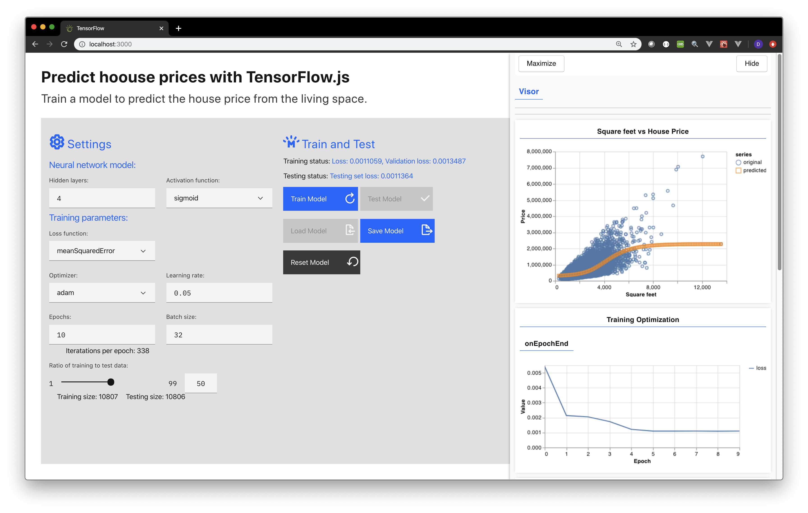

<h1 align="center" style="border-bottom: none;">TensorFlow.js React App - [Visit App URL](https://tensorflow-js.mybluemix.net/)</h1>
<h3 align="center">Train a model to predict the house price from the living space.</h3>

## App URL
https://tensorflow-js.mybluemix.net/


## Prerequisites

1. Sign up for an [IBM Cloud account](https://cloud.ibm.com/registration/).
1. Download the [IBM Cloud CLI](https://cloud.ibm.com/docs/cli/index.html#overview).

## Running locally with React Hot Loader

### Install node dependencies

1. Install the server dependencies

    ```
    predict-house-price$ npm install
    ```

2. Install the client dependencies from client directory

    ```    
    client$ npm install
    ```

### Run the app in developement mode  

1. Start the server (port 3001) and client (port 3000)

    ```
    predict-house-price$ npm start:dev
    ```

2. View the application in a browser at `localhost:3000`

## Deploying to the cloud

This needs to be updated...

1. Build the React application

    ```
    client$ npm run build
    ```

2. Deploy to IBM Cloud

    ```
    predict-house-price$ ibmcloud target --cf   
    ```

    ```
    predict-house-price$ ibmcloud app push -f manifest.yml
    ```

## License

  This sample code is licensed under the [MIT License](https://opensource.org/licenses/MIT).

## Contributing

  See [CONTRIBUTING](.github/CONTRIBUTING.md).
